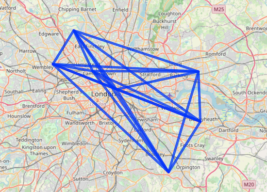

## Project 3: the final countdown

For project 3, we were tasked with modeling population movement within the synthetic population derived in project 2.

# London gravity model: 

Before modeling population movement within my own selected area, I first completed [an exercise](https://rpubs.com/adam_dennett/257231) in creating a gravity model using population data of London, England. 
After downloading the provided data, I took a closer look at its contents. The data contain polygons represeting the various cities and counties of England, along with their spatial coordinates. Next, I subset the data for London and proceeded to generate a distances matrix. This matrix contains the relative distances between loactions of mirgration within the city with respect to the CRS (coordinate reference system) or grid assigned to the area. These endpoints allow us to sketch lines between locations, which serve as "tracks" where flow occurs. After retrieving flow data from an additional source and combining it with the previously mentioned distance and destination data into a dataframe, I plotted a subset of flow lines, which I later modeled. 

 

Next, it was time to make the gravity model. For simplicity, we began with a basic multiplicative gravity model, which functions under the assumption that "the flows between an origin and destination are proportional to the product of the mass of the origin and destination and inversely proportional to the distance between them" (Dennett). To determine the various parameters of the model, rather taking a wild guess, we can consider the impacts of other measurable factors on these parameters. In this example, I referenced salary as a potential predicter of the parameters. After deciding on some starting parameters, which I intended to tweak later, I ran the model on my London data. 

To determine the success of the model, I measured its fit using several statistical measures including R-squared and root mean squared error. 

Although interesting to create, the applications of this technology extend beyond the infrastructure, which is modeled and evaluated above. As descrived by Garcia and other contributers to their 2015 paper 'Modeling internal mirgration flows in sub-Saharan Africa using census microdata', gravity models not only allow us to model population movement and interactions with existing infrastructure but also allow us to model this interactions after introducing alterations to infrastrcutre. After the signifiant changes in transportation that came with globalization, rapid changes in development have occured that either harm or aid in societal transportation flow. In a modern context, traffic is largely dictated by the physical strcutres that direct its flow. For example, the addition of a new exit to a highway could either expedite or impede traffic flow. Using a gravity model, however, these additions can be modeled before any concrete changes are made, saving money, time, and resources.

- effects of globalization, 

 

Before attempting to model the movements of individuals, I frist had to define the locations of origin and destination within each subdivision. These centerpoints were taken from the centerpoints recorded in project 1/2.

 

Within the selected administative subdivision, I documented the predicted movement of individuals in an origin-denstination matrix (OD matrix). This movement, or flow, is represented by geospatial coordinates marking the origin and destination destination of movement along with a calculated distance and time component. After generating flows from each subdivision to every other subdivision, I removed flows that maped from a subdivision back to itself and those that did not originate form my selected location. Below is a portion of my OD matrix- 

 

 
